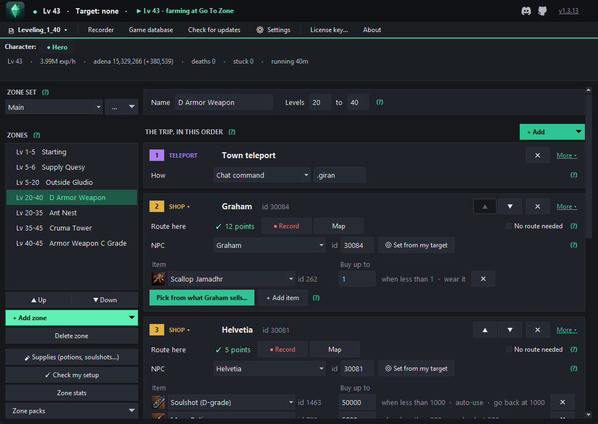
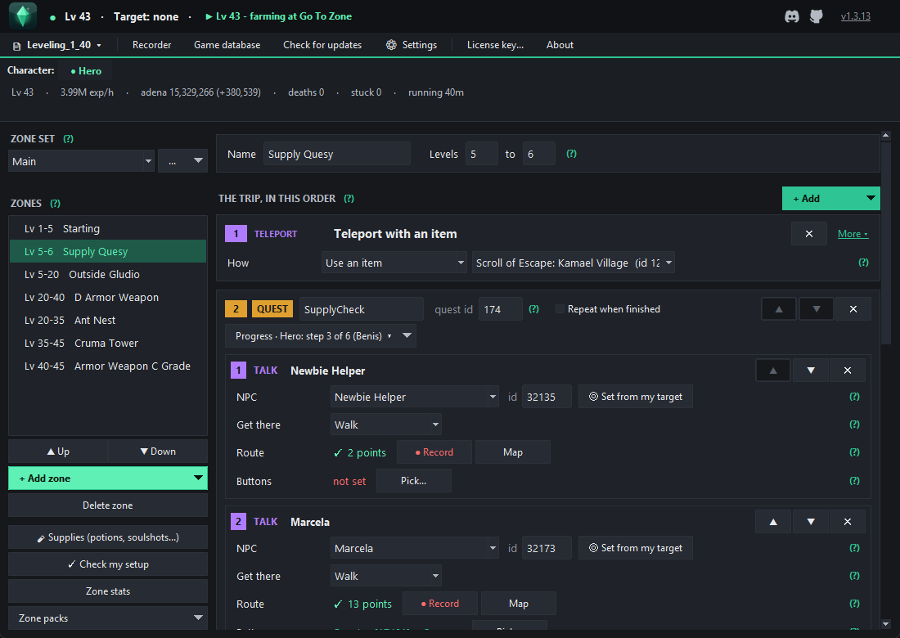
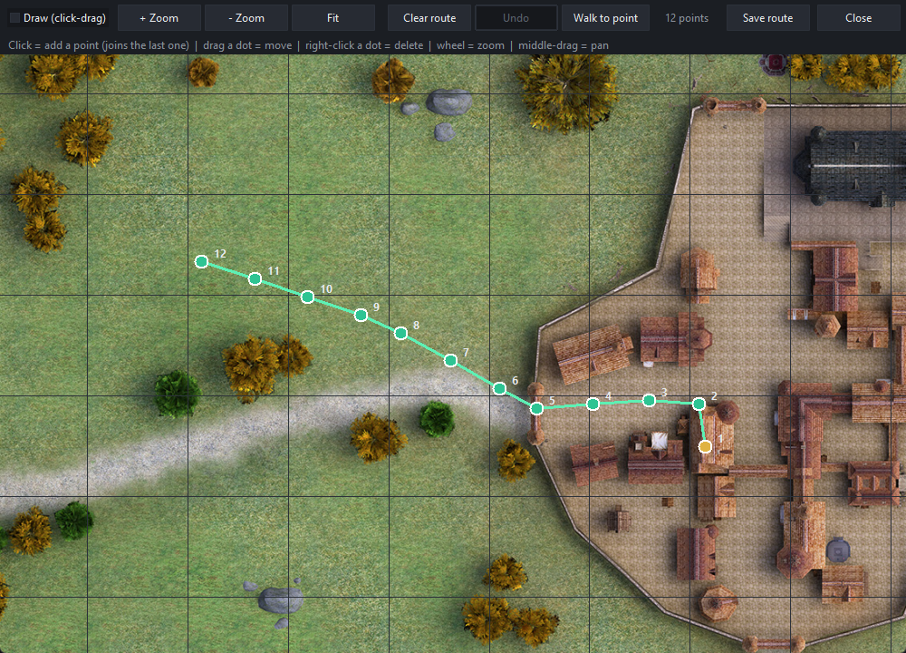
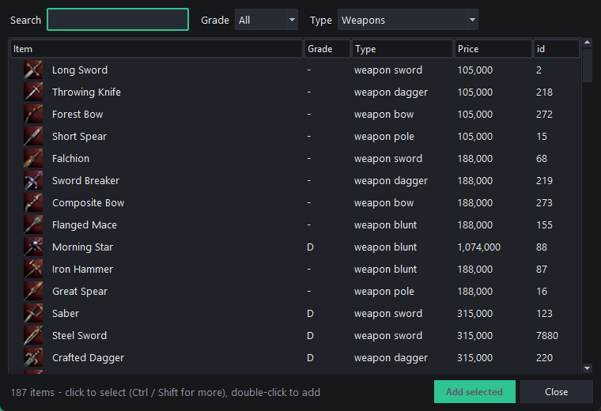
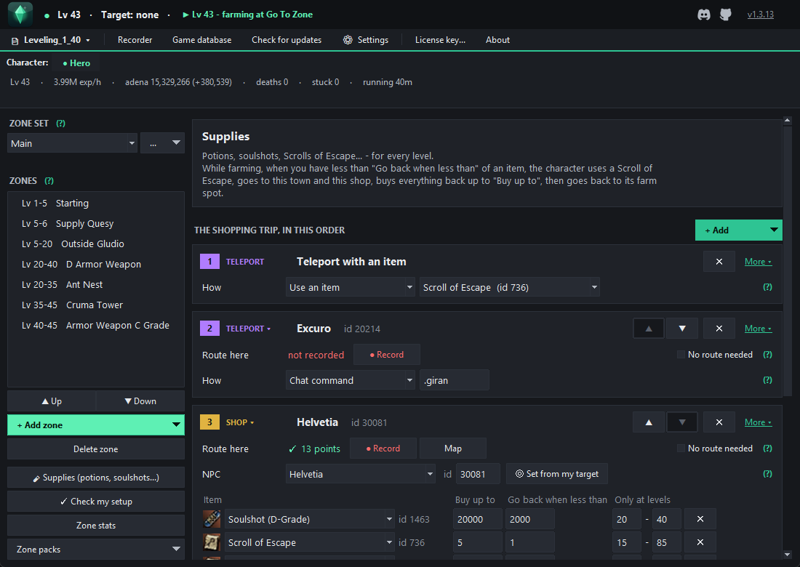
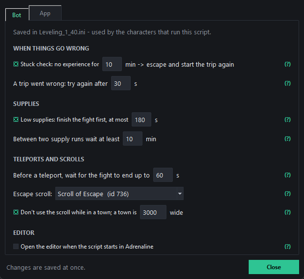
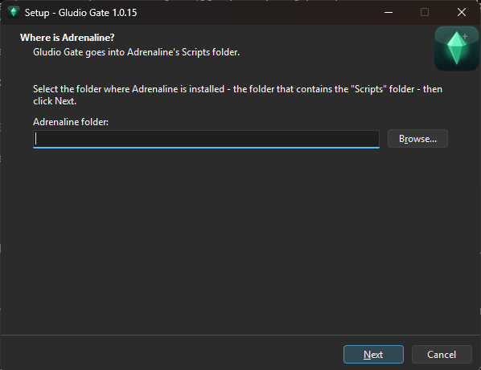
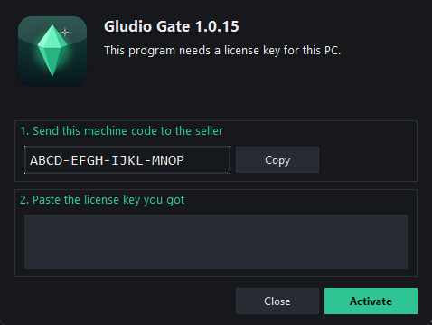

# Gludio Gate

**Build your own automatic leveling for the Adrenaline bot (Lineage 2 High Five) — for any levels you want.**

Set up your zones once and your character levels by itself: it teleports, buys gear and supplies, does quests,
walks to the right farm spot and moves on when it levels up. No scripting — everything is done with clicks.

💬 **[Join our Discord](https://discord.gg/PUMUGWgAkY)** for help, news and zone packs.
📖 **[Step-by-step manual](MANUAL.md)** — from install to a character that levels by itself.

> Adrenaline does the **fighting** (skills, buffs, potions, pick up).
> Gludio Gate decides **where to go and what to buy** — and moves on by itself.

---

## ✨ What it does

- 🗺️ **Zones for any levels** — up to 100 zones; several steps per level range (e.g. *shop in Giran → farm at Ant Nest*).
- 🧭 **One trip list per zone** — teleport → shops, gatekeepers and quests in **your** order → farm spot. Move anything with ▲ ▼, remove with ✕.
- 📜 **Quests** — talk steps (accept, deliver, turn in) and hunt steps (collect quest items at the farm spot). Each character keeps its own progress, stays in the zone until the quest is done, and **goes on where it stopped** after a restart.
- 🛒 **Shops** — pick items straight from **what the merchant sells** (grade, type, price, icons). Gear is bought once and worn.
- 🧪 **Supplies** — one shop for potions, soulshots and scrolls at every level. Running low while farming → scroll to town, restock, back to farming. Soulshot grades switch by level by themselves. **Sell junk** at every shop visit.
- 🎥 **Routes** — press **Record** and walk in game, or draw and fix them on the **real game map**. Smooth walking, no stops at every point.
- 🛡️ **Safe** — stuck check, retries when a gatekeeper fails, finishes the fight before teleporting, never wastes a Scroll of Escape in town.
- ⚙️ **Settings** — timings, escape scroll, theme, language, folders — all in one place.
- 📊 **Live stats** — level %, exp/hour, time to next level, adena, deaths, plus game messages in plain words.
- 👥 **Several characters** at once, **several scripts** (e.g. one for mages), **zone packs** to share setups.
- 🔎 **Game database** — find any item, NPC or skill with its id and icon.
- 🔄 **Updates itself** — click *Yes* and it's done.

---

## 🧭 How it works

**1. Build the trip for each level range** — in the order the character should do it:

**2. Add quests right into the trip** — each character's progress is saved, a restart goes on where it stopped:

**3. Record or draw the routes on the real game map:**

**4. Shopping lists from what the merchant really sells:**

**5. One Supplies shop for every level** — the character restocks by itself when it runs low:

**6. Run** `Leveling_1_40.txt` in Adrenaline — the top bar shows what the character is doing, with live stats.

*Settings — sensible defaults, change them only if you want to.*

---

## 📥 Install

1. **[Releases](../../releases)** → newest version → download **`GludioGateSetup.exe`**.
2. Run it and select your **Adrenaline folder** (the one that contains `Scripts`).
3. Start **Gludio Gate** from the desktop shortcut.

> *"Windows protected your PC"*? Click **More info → Run anyway** — the program is new, not harmful.

**Needs:** Windows 10/11 · Adrenaline · a Lineage 2 **High Five** server · a license key.

### 🔑 Activation

On first start the editor shows your **machine code** → **Copy** → send it to the seller → paste the **license key** you get → **Activate**.
One key works on one PC; a new PC or a Windows reinstall needs a new key.

### ▶️ Start leveling

1. Log in your character and set up fighting in Adrenaline as usual.
2. In Adrenaline run **`Scripts\Leveling\Gludio Gate\Leveling_1_40.txt`**.
3. Open Gludio Gate to build and change your zones — everything saves by itself.

New to it? Follow the **[step-by-step manual](MANUAL.md)**.

---

## 🔄 Updates

The editor checks for a new version when it starts — click **Yes** and it updates itself and the scripts.
Your zones and settings are never overwritten.

---

## ❓ Help

Questions, zone packs and news: **[our Discord](https://discord.gg/PUMUGWgAkY)**.
When something goes wrong, post the red lines from Adrenaline's log.
